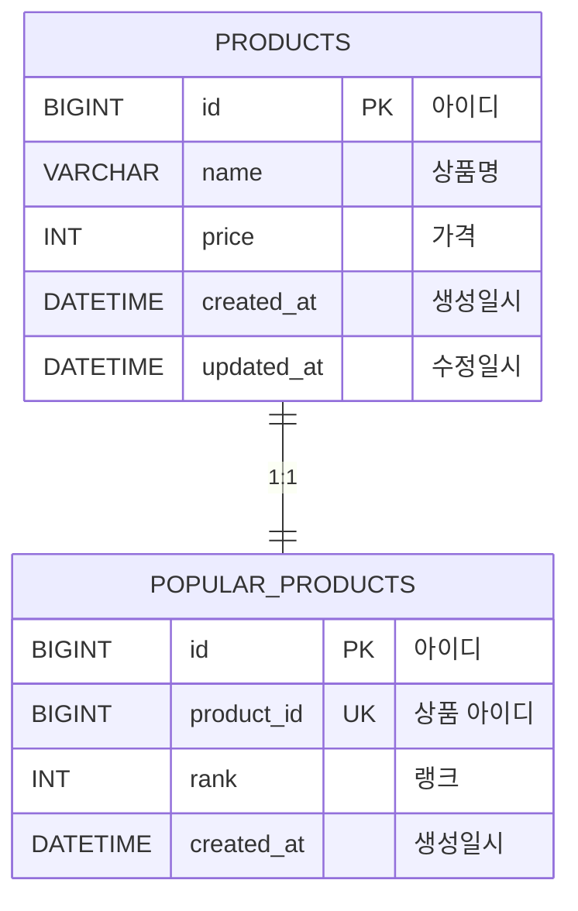
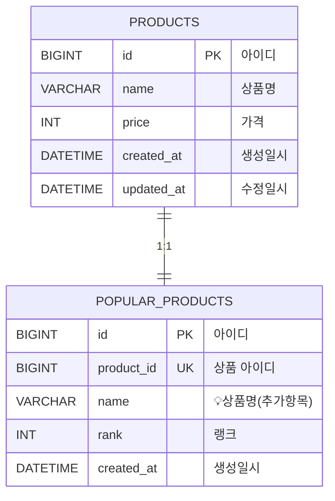
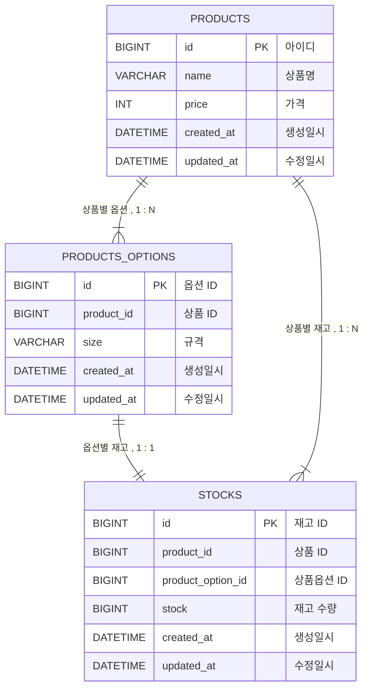
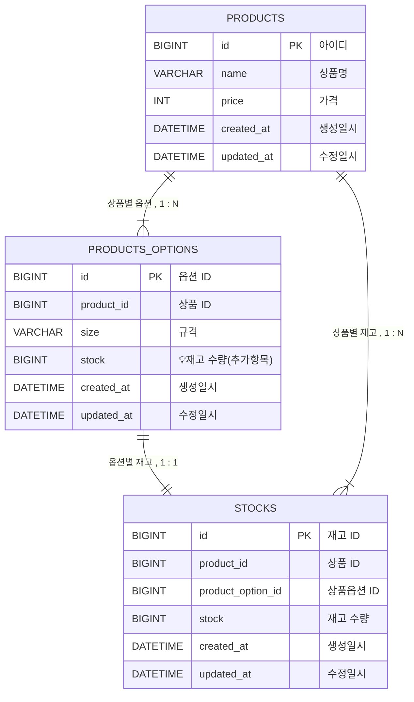

# ADR-001: 인기상품 중복컬럼 추가

### 문제상황
- 현재 인기 상품 데이터를 조회할 때 상품명(name)을 함께 출력해야 하므로
POPULAR_PRODUCTS와 PRODUCTS 테이블 간 JOIN이 필요하다.
이로 인해 인기 상품 조회 API의 응답 속도에 영향을 줄 수 있으며,
특히 트래픽이 집중되는 시간대에는 JOIN 비용 증가로 인해
상품 테이블에 부하가 발생할 수 있다는 성능 이슈가 있다.
- 인기 상품 조회 시 비즈니스 적으로 중요한 PRODUCTS에 부하를 주는 것이 부담이라고 판단.
- **AS IS ERD**

### 해결책
- POPULAR_PRODUCTS 테이블에 'product_name' 중복 컬럼을 추가한다.   
- **TO BE ERD**

### 해결책 상세 내용
- 인기상품 조회 시 **PRODUCTS 테이블**과의 JOIN을 하지 않아 성능 및 부하를 보완한다.  
- 상품명이 수정될 경우 비동기적으로 인기상품 테이블의 상품명을 수정한다.
  - 인기상품 조회시 상품명 표출은 비즈니스 로직에 큰 영향을 주지 않는다고 판단하여  
  Eventual consistency를 보장.
  

# ADR-002: 상품옵션 중복컬럼 추가

### 문제상황
- 현재 상품 정보를 조회할 때   
  PRODUCTS, PRODUCTS_OPTIONS, STOCKS 테이블 간 JOIN이 필요하다.  
  이로 인해 상품 정보 조회 시 API의 응답 속도에 영향을 줄 수 있으며,  
  특히 트래픽이 집중되는 시간대에는 JOIN 비용 증가로 인해  
  상품 재고 테이블에 부하가 발생할 수 있다는 성능 이슈가 있다.
- **AS IS ERD**

### 해결책
- PRODUCTS_OPTIONS 테이블에 'stock' 중복 컬럼을 추가한다.
- **TO BE ERD**

### 해결책 상세 내용
- 상품 정보 조회 시 PRODUCTS, PRODUCTS_OPTIONS 테이블만 JOIN 하여  
성능 및 부하를 보완한다.
- 재고테이블에서 재고가 수정될 경우 비동기적으로 상품 옵션 테이블의 재고를 수정한다.
  - 결제 시 STOCKS 테이블의 상품 재고를 차감하므로 재고에 대한  
  데이터 정합성 이슈는 발생하지 않는다.
  - 재고에 대한 데이터 정합성 이슈는 발생하지 않으므로 Eventual consistency를 보장.

### 미채택 해결 내용
- PRODUCTS_OPTIONS 테이블에 상품 가격, 상품명 중복 컬럼을 추가한다. 
  - 상품 정보 조회 시 상품 가격, 상품명은 중요한 비즈니스 정보이므로  
  비동기적으로 수정되면 안되기 때문에 해당 해결책은 미채택.
  