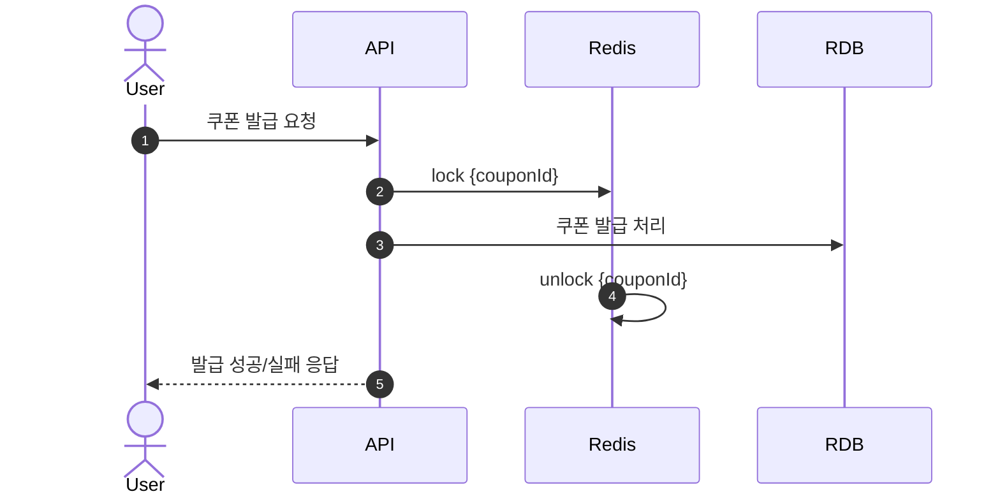

# 📊 쿠폰 발급 시스템 부하 테스트 시나리오

## 1. ✅ 부하 테스트 대상

- **대상 기능**: 쿠폰 발급 API
- **테스트 방식**: HTTP POST 요청 부하 테스트

---

## 2. 🎯 부하 테스트 대상 선정 이유

쿠폰 발급 기능은 마케팅 이벤트나 쇼핑몰 프로모션 등 짧은 시간 동안 대량의 트래픽이 몰리는 상황에서 자주 사용되는 핵심 기능입니다. 특히 사용자가 특정 시간대에 몰려 한정된 수량의 쿠폰을 발급받으려는 경쟁 상황이 발생할 수 있기 때문에, 시스템이 이러한 부하 상황에서도 안정적으로 동작할 수 있는지 사전 검증이 필요합니다.

또한 이 과정에서 다음과 같은 시스템적 특성이 존재합니다:
- 사용자 수의 급격한 증가: 이벤트 시작 시점에 사용자들이 동시에 요청을 보내며 대규모 트래픽이 순간적으로 유입됨 (POD 부하) 
- 복수의 시스템 자원 의존도: 쿠폰 발급 과정에서 Redis, RDB, Kafka 등 다양한 인프라가 연계되어 있어, 이들에 대한 부하도 함께 발생

---

## 3. 🎯 부하 테스트 목적

부하 테스트를 통해 **서버 인스턴스별 리소스 사용량과 성능 지표**를 수집하고,  
서버의 스펙 산정 및 스케일 아웃 기준을 설정하는 것이 목적입니다.

측정 항목:

- TPS (초당 트랜잭션 수)
- RPS (초당 요청 수)
- 요청 실패율
- P90, P95 응답 시간 지표
- Redis, RDB, Kafka, POD 의 리소스 사용량 (CPU/Memory)

---

## 4. 🎯 쿠폰 발급 기능 및 부하 테스트 구간
- 쿠폰 발급 순서
1.  `사용자 쿠폰 발급 요청`
2.  `SISMEMBER set:coupon-available {couponId}`
    - 발급 가능 목록에 존재하는 쿠폰인지 확인
    - redis set 자료구조
3.  `Kafka 메시지 발행 (key = couponId , payload = {userId : 4}  포함)`
4.  `사용자에게 `requestId` 응답 → 이후 사용자는 polling으로 발급 여부 확인`
5.  `Kafka Consumer에서 메시지 수신`
    * 발급 정보 RDB 저장
    * 발급 성공/실패 결과 Redis hash 자료구조에 저장
- 쿠폰 발급 시퀀스 다이어그램
    ```mermaid
    sequenceDiagram
        actor User
      participant API
      participant Redis
      participant Kafka
      participant Consumer
      participant RDB
      autonumber
        
      User->>API: 쿠폰 발급 요청
      API->>Redis: SISMEMBER set:coupon-available {couponId}
      API->>Kafka: 메시지 발행 (userId, couponId, requestId)
      API-->>User: requestId 응답
      Kafka->>Consumer: 메시지 전달
      Consumer->>RDB: 쿠폰 발급 처리
      Consumer->>Redis: PUT hash:coupon:result:{requestId} = success/fail
      User->>API: requestId로 발급 여부 polling
      API->>Redis: GET hash:coupon:result:{requestId}
      API-->>User: 발급 결과 응답
    ```

- 성능지표 (TPS, 요청 실패율, 응답시간 P90/P95 등) 부하 테스트 구간
1.  `사용자 쿠폰 발급 요청`
2.  `SISMEMBER set:coupon-available {couponId}`
    - 발급 가능 목록에 존재하는 쿠폰인지 확인
    - redis set 자료구조
3.  `Kafka 메시지 발행 (key = couponId , payload = {userId : 4}  포함)`
4.  `사용자에게 `requestId` 응답 → 이후 사용자는 polling으로 발급 여부 확인`
    ```mermaid
    sequenceDiagram
        actor User
      participant API
      participant Redis
      participant Kafka
      participant Consumer
      participant RDB
      autonumber
        
      User->>API: 쿠폰 발급 요청
      API->>Redis: SISMEMBER set:coupon-available {couponId}
      API->>Kafka: 메시지 발행 (userId, couponId, requestId)
      API-->>User: requestId 응답
    ```
- 부하 테스트 구간을 1~4 단계까지만 선정한 이유  
  - 쿠폰 발급 프로세스는 이벤트 기반 아키텍처로 설계되어 있어, 사용자의 요청 이후(5단계부터)는 Kafka를 통해 비동기적으로 처리됩니다. Kafka를 이용한 비동기 처리의 목적은 사용자 응답 속도 개선보다는 대량 트래픽 수용에 초점을 맞추고 있기 때문에 CPU/Memory 사용량만 모니터링하고, TPS, P90 등 성능 지표는 측정하지 않았습니다. 
  - 테스트 범위를 부하가 집중되는 동기 처리 API 구간에 한정함으로써, POD <-> 사용자 사이의 병목 및 성능 한계를 분석하기 위함 입니다.

---


## 5. ⚙️ 부하 테스트 도구 및 환경 구성

부하 테스트는 아래와 같은 오픈소스 도구들을 연동하여 수행했습니다.
테스트 환경은 Docker 기반으로 구성하여 재현성과 유연성을 확보했습니다.
- k6: 고성능 부하 테스트 도구로, JavaScript 기반 스크립트로 다양한 시나리오 구성 가능
- Grafana: InfluxDB 데이터를 시각화하여 실시간 모니터링 대시보드 제공
- InfluxDB: 시계열 데이터베이스, 테스트 지표(RPS, TPS, 실패율 등)를 k6로부터 전달 받는 저장소
- Docker Compose: 부하 테스트 도구(Grafana, InfluxDB)와 인프라 서버(POD, Redis, MySQL, Kafka)를 컨테이너화하여, 서버 스펙을 유연하게 조정하며 테스트 환경을 구축

---

## 6. 🧱 서버별 리소스 스펙

| 구성 요소 | ec2 인스턴스 타입 대상 | CPU    | Memory |
|-------|----------------|--------|--------|
| Redis | `c5.xlarge`    | 4 vCPU | 8GB   |
| Mysql | `c5.xlarge`    | 4 vCPU | 8GB   |
| Kafka | `c5.xlarge`    | 4 vCPU | 8GB   |
| POD   | `c5.xlarge`    | 4 vCPU | 4GB   |

※ Docker 컨테이너 실행 시 위 스펙에 맞춰 `cpus` 및 `memory` 설정 적용

---

## 7. 🧪 부하 테스트 시나리오

- **테스트 유형**: Peak test
- **테스트 가정**: 이벤트 시작 후 10,000명의 사용자 트래픽이 집중 되는 상황  
- **테스트 시간**: 1분
- **테스트 방식**: `POST /쿠폰발급` 요청 RPS를 4000부터 점차적으로 증가 
- **테스트 데이터**:
    - 각 요청 사용자는 4종류의 쿠폰 중 하나를 무작위로 발급 요청
    - 각 쿠폰 발급 가능 수량: 5,000장 (총 20,000장)
- **테스트 목표**:
    - 쿠폰 20,000건이 정상 발급되었는지 확인 
    - 목표 응답시간(P95 < 500ms)
    - 목표 실패율 0%
    - 위 지표에 충족하는 TPS 를 측정하여 스케일 아웃 기준 산정

--- 

## 8. 🔁 Kafka 도입 전 쿠폰 발급 기능과의 비교
- Kafka를 도입하기 전에는 사용자의 쿠폰 발급 요청을 수신한 후, Redis 기반 분산 락을 통해 RDB 적재까지 동기적으로 처리하는 구조였습니다. 동일한 테스트 시나리오로 쿠폰 발급 시 kafka 도입 전 후의 결과를 비교하여 기존 구조의 한계를 파악하는데 목적이 있습니다.

### ⚙️ RDB/Redis 기반 처리 흐름
    1.	사용자 쿠폰 발급 요청
    2.	Redis를 이용한 분산 락 획득 (쿠폰 ID 기준)
    3.	쿠폰 재고 확인 및 RDB 저장 (RDB 트랜잭션 종료 후 분산락 해제)
    4.	사용자에게 발급 성공/실패 응답 반환

