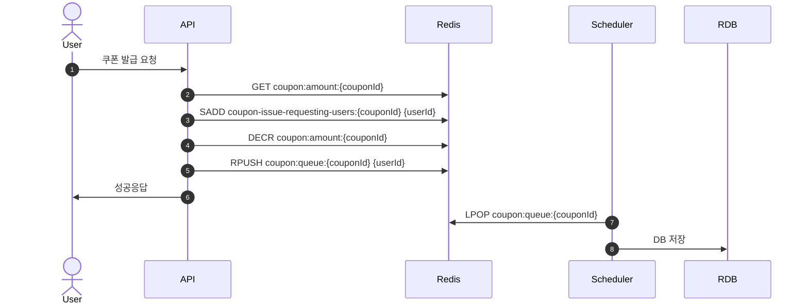
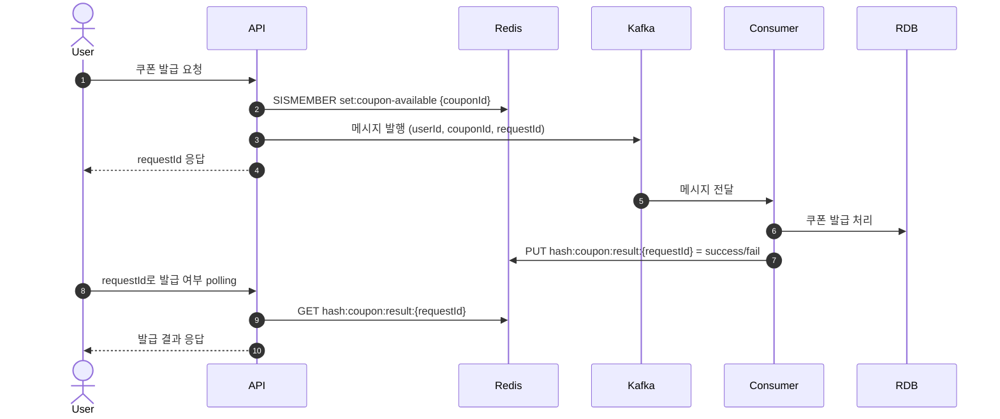

# 🧾 쿠폰 발급 시스템 개선 보고서

## 📌 개요

기존 Redis 기반의 쿠폰 발급 시스템(AS-IS)은 높은 요청 처리 성능을 가지고 있었지만,  
데이터 정합성, 시스템 복잡도 등의 측면에서 확장성과 신뢰성에 제약이 있었습니다.  
이를 해결하기 위해 Kafka를 도입한 구조(TO-BE)로 개선하였습니다.

---

## 🔁 AS-IS 구조 (Redis 기반)

### 🔄 처리 흐름

1.  사용자 쿠폰 발급 요청

2. `GET coupon:amount:{couponId}`
    -  재고 확인. 키 없으면 예외 발생 
    -  redis String 자료구조
3.  `SADD coupon-issue-requesting-users:{couponId} {userId}`
    - 중복 요청 사용자 차단. 이미 있으면 예외 발생 
    - redis set 자료구조
4.  `DECR coupon:amount:{couponId}`
    -  수량 차감. 0 미만이면 키 제거 후 예외
    -  redis String 자료구조
5.  `RPUSH coupon:queue:{couponId} {userId}`
    - (redis list 자료구조)큐 적재 후 백그라운드에서 1초마다 스케줄링으로 `LPOP`하여 DB 저장

### ❗ 문제점

1. **데이터 정합성 보장 불가**
    - 1~5 번 과정 진행 중 인프라 혹은 네트워크 이슈로 데이터 정합성 이슈 발생 가능
      - ex: (3번과정) SADD 후 4~5 번에서 ERROR 발생 시  
      쿠폰 발급이 정상적으로 진행 되지 않고 재시도 또한 불가한 사용자 발생 
2. **Redis 데이터 손실 우려**
    - Redis에 먼저 적재 후 나중에 DB 저장 → Redis 장애 시 데이터 손실 우려
3. **추적 어려움**
   - 사용자는 발급 요청 결과를 실시간으로 확인 불가 
   - 사용자가 '발급완료' 응답을 받는 시점이                   
   RDB에 발급 정보가 적재 되었을 때가 아닌 redis 연산에 의존하기 때문에   
   Redis , DB 간 정합성이 맞지 않을 경우 추적이 어려움

### 🧭 AS-IS 시퀀스 다이어그램 (Mermaid)

---

## 🚀 TO-BE 구조 (Redis + Kafka 기반)

### 🔄 처리 흐름

1.  `사용자 쿠폰 발급 요청`
2.  `SISMEMBER set:coupon-available {couponId}`
    - 발급 가능 목록에 존재하는 쿠폰인지 확인 
    - redis set 자료구조
3.  `Kafka 메시지 발행 (key = couponId , payload = {userId : 4}  포함)`
4.  `사용자에게 `requestId` 응답 → 이후 사용자는 polling으로 발급 여부 확인`
5.  `Kafka Consumer에서 메시지 수신`
    * 발급 정보 RDB 저장 
    * 발급 성공/실패 결과 Redis hash 자료구조에 저장

### ✅ 개선 효과

* 🔐 **신뢰성 향상**: Kafka 기반 비동기 처리로 데이터 유실 없이 안정적인 저장과 인프라 시스템 부하 방지 가능
* ⚙️ **확장성 강화**: Consumer 수평 확장이 용이해 대량 요청 처리 가능
* 👁️ **사용자 응답 개선**: `requestId`로 실제 발급 여부 추적 가능
* 🔄 **순서 보장**: couponId를 이벤트 key로 사용하기 떄문에 순서 보장 가능

### 🧭 TO-BE 시퀀스 다이어그램 (Mermaid)

### ✅ 추가 개선 가능 사항

* 🔄 **이벤트 발행 보장**: `Transactional outbox pattern` 도입으로 이벤트 발행 시 유실 방지  
* 🔄 **이벤트 발행 구독 안정성 보장**: `Dead Letter Queue(Topic)` 도입으로 발행 된 이밴트의 구독 실패 및 서비스 로직 실패 시 이벤트 추적 및 재처리 가능 
* 🔄 **실시간 인프라 DB 부하 방지**: 컨슈머에 `동적 쓰로틀링`을 적용하여 서버 자원 모니터링에 따른 컨슈머 처리량 조절