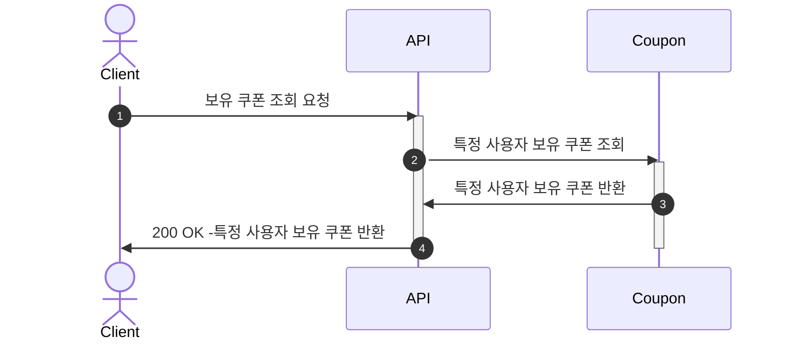
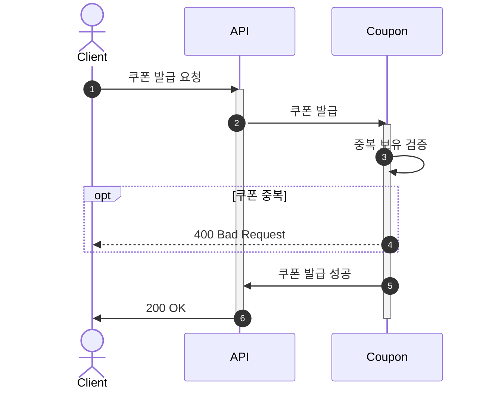

## 보유 쿠폰 조회 

```mermaid
sequenceDiagram
    autonumber
    actor Client as Client
    participant API as API
    participant Coupon as Coupon
    
    Client ->> API: 보유 쿠폰 조회 요청
    activate API
    API ->> Coupon: 특정 사용자 보유 쿠폰 조회
    activate Coupon
    
    Coupon ->> API: 특정 사용자 보유 쿠폰 반환
    API ->> Client: 200 OK -특정 사용자 보유 쿠폰 반환
    deactivate Coupon
    deactivate API

    

```
## 쿠폰 발급

```mermaid
sequenceDiagram
    autonumber
    actor Client as Client
    participant API as API
    participant Coupon as Coupon

    Client ->> API: 쿠폰 발급 요청
    activate API
    API ->> Coupon: 쿠폰 발급 
    activate Coupon
    Coupon ->> Coupon: 중복 보유 검증
    opt 쿠폰 중복
        Coupon -->> Client: 400 Bad Request
    end
    Coupon ->> API: 쿠폰 발급 성공
    API ->> Client: 200 OK 
    deactivate Coupon
    deactivate API
    
    

    
```