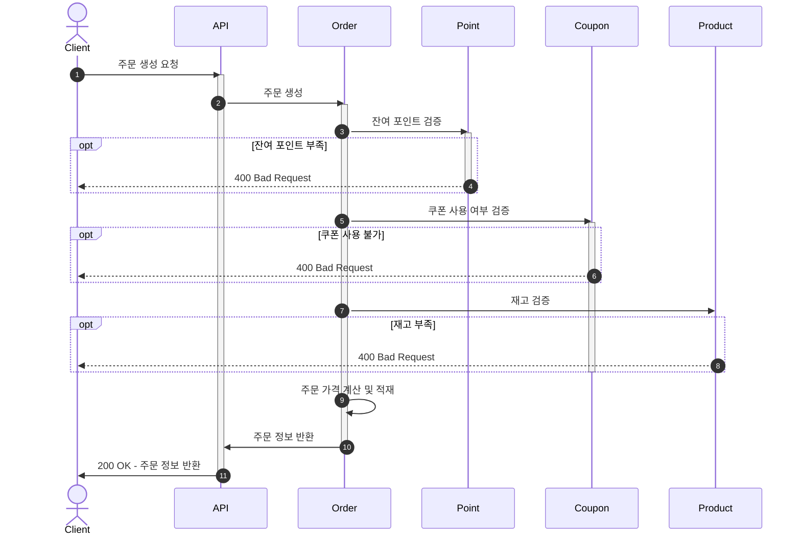

## 주문 생성

```mermaid
sequenceDiagram
    autonumber
    actor Client as Client
    participant API as API
    participant Order as Order
    participant Point as Point
    participant Coupon as Coupon
    participant Product as Product

    Client ->> API: 주문 생성 요청
    activate API

    API ->> Order: 주문 생성
    activate Order
    Order ->> Point: 잔여 포인트 검증
    activate Point
    opt 잔여 포인트 부족
    Point -->> Client: 400 Bad Request
    deactivate Point
    end
    Order ->> Coupon: 쿠폰 사용 여부 검증
    activate Coupon
    opt 쿠폰 사용 불가 
        Coupon -->> Client: 400 Bad Request
    end
    Order ->> Product: 재고 검증
    activate Product
    opt 재고 부족
        Product -->> Client: 400 Bad Request
    end
    
    deactivate Coupon
    Order ->> Order : 주문 가격 계산 및 적재
    Order ->> API : 주문 정보 반환
    deactivate Order
    API ->> Client : 200 OK - 주문 정보 반환
    deactivate API
```