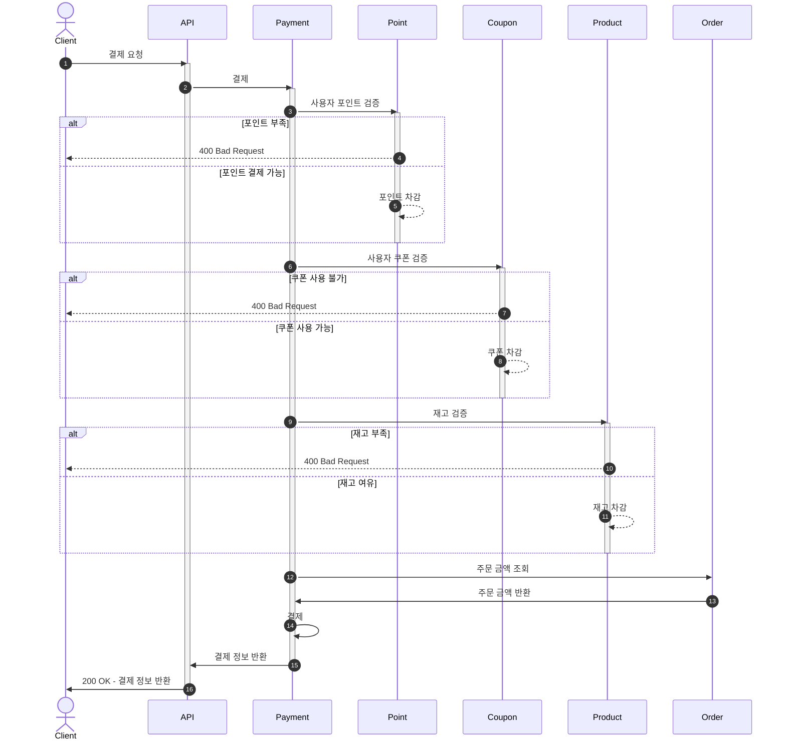

## 결제

```mermaid
sequenceDiagram
    autonumber
    actor Client as Client
    participant API as API
    participant Payment as Payment
    participant Point as Point
    participant Coupon as Coupon
    participant Product as Product
    participant Order as Order
    
    Client ->> API : 결제 요청
    activate API
    API ->> Payment : 결제
    activate Payment
    
    Payment ->> Point : 사용자 포인트 검증
    activate Point
    alt 포인트 부족
        Point -->> Client:400 Bad Request
    else 포인트 결제 가능
        Point -->> Point: 포인트 차감
    end
    deactivate Point

    Payment ->> Coupon : 사용자 쿠폰 검증
    activate Coupon
    alt 쿠폰 사용 불가
        Coupon -->> Client:400 Bad Request
    else 쿠폰 사용 가능
        Coupon -->> Coupon: 쿠폰 차감
    end
    deactivate Coupon

    Payment ->> Product : 재고 검증
    activate Product
    alt 재고 부족
        Product -->> Client:400 Bad Request
    else 재고 여유
        Product -->> Product: 재고 차감
    end
    deactivate Product
        
    Payment ->> Order : 주문 금액 조회
    Order ->> Payment : 주문 금액 반환
    Payment ->> Payment : 결제
    
    
    Payment ->> API : 결제 정보 반환
    deactivate Payment
    API ->> Client : 200 OK - 결제 정보 반환
    deactivate API
    
                                    
```