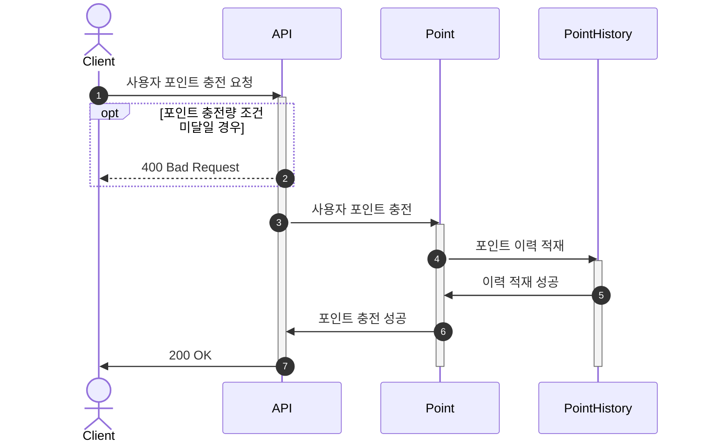
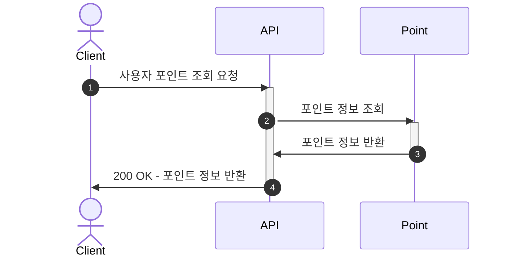

## 사용자 포인트 충전

```mermaid
sequenceDiagram
    autonumber
    actor Client as Client
    participant API as API
    participant Point as Point
    participant PointHistory as PointHistory

    Client ->> API: 사용자 포인트 충전 요청
    activate API

    opt 포인트 충전량 조건 미달일 경우
        API -->> Client: 400 Bad Request
    end

    API ->> Point: 사용자 포인트 충전
    activate Point
    
    Point ->> PointHistory: 포인트 이력 적재
    activate PointHistory
    PointHistory ->> Point: 이력 적재 성공
    Point ->> API: 포인트 충전 성공
    API ->> Client: 200 OK
    
    deactivate Point
    deactivate PointHistory
    deactivate API

```
## 사용자 포인트 조회

```mermaid
sequenceDiagram
    autonumber
    actor Client as Client
    participant API as API
    participant Point as Point

    Client ->> API: 사용자 포인트 조회 요청
    activate API

    API ->> Point:  포인트 정보 조회
    activate Point
    
    Point ->> API:  포인트 정보 반환
    deactivate Point
    API ->> Client : 200 OK - 포인트 정보 반환 
    deactivate API
```