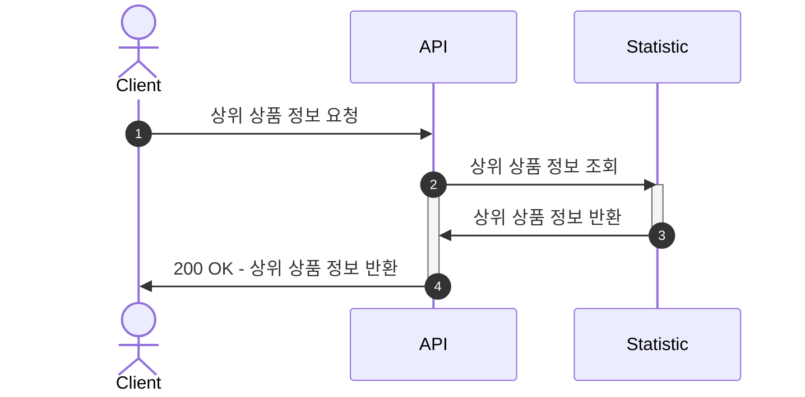
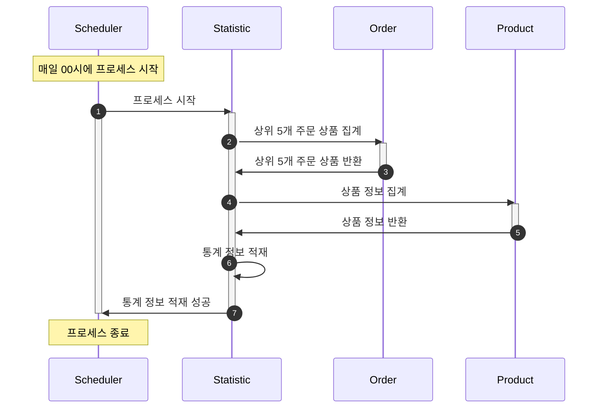

## 판매 상위 5개 상품 조회

```mermaid
sequenceDiagram
    autonumber
    actor Client as Client
    participant API as API
    participant Statistic as Statistic
    
    Client  ->> API : 상위 상품 정보 요청
    API ->> Statistic : 상위 상품 정보 조회
    activate Statistic
    activate API
    Statistic ->> API : 상위 상품 정보 반환
    deactivate Statistic
    API ->> Client : 200 OK - 상위 상품 정보 반환
    deactivate API
```

## 판매 상위 5개 상품 적재

```mermaid
sequenceDiagram
    autonumber
    participant Scheduler as Scheduler
    participant Statistic as Statistic
    participant Order as Order
    participant Product as Product
    

    note over Scheduler: 매일 00시에 프로세스 시작
    Scheduler ->> Statistic : 프로세스 시작
    activate Scheduler
    activate Statistic

    Statistic ->> Order : 상위 5개 주문 상품 집계
    activate Order
    Order ->> Statistic : 상위 5개 주문 상품 반환
    deactivate Order
    Statistic ->> Product : 상품 정보 집계
    activate Product
    Product ->> Statistic : 상품 정보 반환
    deactivate Product
    Statistic ->> Statistic : 통계 정보 적재
    Statistic ->> Scheduler : 통계 정보 적재 성공
    deactivate Scheduler
    deactivate Statistic
    note over Scheduler: 프로세스 종료
    
    
    
```